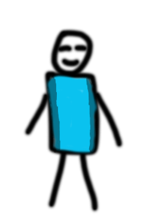
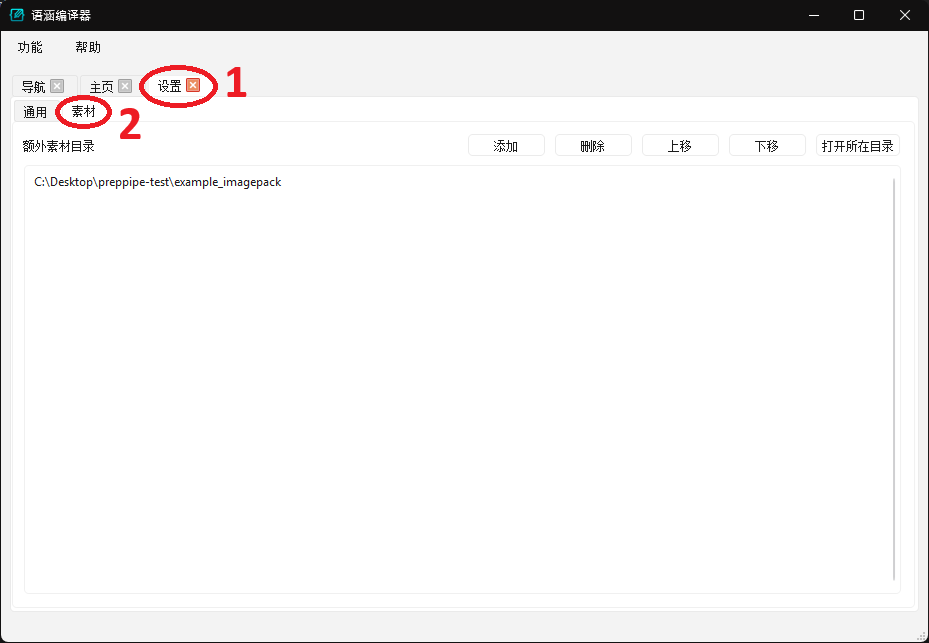
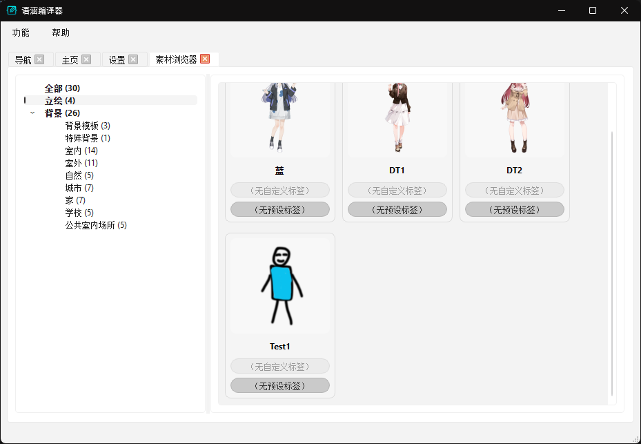
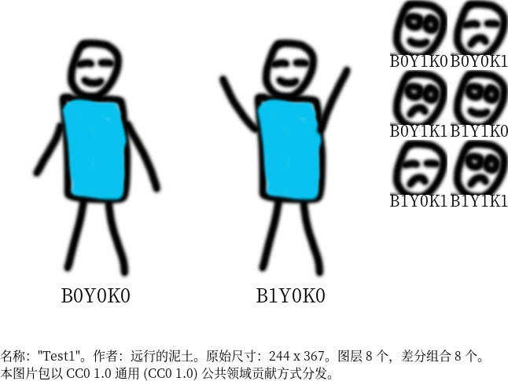

# 素材系统配置指南

本页文档介绍语涵编译器的素材管理系统，包括以下方面：

1. 素材系统整体的架构与使用方式
2. 主要素材类型的组织形式和配置文件规格。目前仅介绍图片包(ImagePack)

## 素材系统
### 概述

语涵编译器的素材系统用于管理程序中使用的各种资源，包括背景图片、角色立绘、字体文件等。素材的使用方式包括(1)用户在剧本中直接引用素材，程序将在生成游戏工程时将其导出，(2)用户可在 UI 中查看现有素材并使用部分功能（比如图片包素材可查看差分、使用改色功能等），(3)语涵编译器会固定使用部分特殊素材，比如在背景模板的屏幕上添加文字时自动使用内嵌字体。目前图片类的素材可在 UI 中的“素材浏览器”查看，其他素材暂时不提供查看方式。

素材有两种来源：

- 程序内嵌：由语涵编译器开发者们准备的素材，随程序一起分发。我们保证所有内置素材免费可商用。
- 用户导入：用户或第三方导入到程序内的素材。

两种来源的素材在导入后不会有区别对待，用户可用相同方式使用所有素材。

!!! note "资源仓"

    语涵编译器的所有内嵌资源都由 `preppipe-assets` 仓管理，后面也会从该仓找配置文件样例。

### 素材的配置与构建

语涵编译器的素材系统设计主要考虑以下几点：
1. 用户在配置素材时应当：
   1. 有足够的自由度以使用语涵编译器提供的特性、功能（比如图片包的选区功能等）；
   2. 不应有过度复杂、难以手工完成的配置或图片处理；
   3. 配置文件在不同版本的程序中应当尽可能稳定，避免需要手动修改。
2. 程序读取、使用素材的速度应当尽可能快。

为了调和以上设计目的的矛盾，语涵编译器使用双阶段的素材形式：
1. 源文件形态：手动配置素材时（包括程序内嵌素材）使用的形态，满足自由度、易用性和稳定性的要求。
2. 构建形态（或者说打包形态）：程序运行期间使用的形态，满足运行效率要求。打包形态的素材格式可能在版本更新中演进，不同程序版本不保证能共用。

程序会在用户导入素材时自动构建打包形态的素材并使用，程序版本更新时自动重新构建。内嵌素材会在程序构建出包时一并构建。本页文档接下来主要以用户导入素材的视角进行介绍。

### 用户导入素材

语涵编译器导入素材时，每次导入均以文件夹（目录）为单位，目录下可以包含多个素材。

接下来，我们以一个最简单的立绘素材为例，介绍素材导入的流程：



预先准备好的源文件形态素材[点这里保存](assetconfig/example_charactersprite.zip)。原PSD文件可以[点这里保存](assetconfig/example_charactersprite.psd)。请新建一个文件夹，并将素材文件解压到这里。

接下来，请进入语涵编译器的图形界面(UI)，打开**设置**页面，进入**素材**一栏，并将素材目录输入到列表中（可以点添加按钮也可以将目录拖拽到列表里），如图所示：



设置完成后，打开素材浏览器（如果之前已打开则需要先关闭再开启），就可以在立绘分类下找到这个导入的立绘了：



!!! warning "注意事项"

    如果程序在读取用户导入的素材时出错（比如缺少文件或者配置文件格式错误），目前程序对这种场景的错误处理还不完善，可能出现程序崩溃或者操作无反应等情况。如需调试支持请联系开发者。

#### 路径说明

如上面样例所示，语涵编译器导入素材时指定的是目录。目录内应包含 `preppipe_asset_manifest.yml` 文件，该文件列举了当前素材目录下有哪些素材，它们各自的类型，以及它们的配置文件所在目录。目录不包含该文件或是文件名错误会导致导入失败。

当指定的素材目录包含 `preppipe_asset_manifest.yml` 文件时，语涵编译器会尝试构建其中列举的所有素材并保存它们的打包形态。打包形态的内容会存放在素材目录**上一级**下新建的 `__preppipe_build__` 目录中。如果素材目录里的配置文件在 `C:\Common\Path\AssetsPack1\preppipe_asset_manifest.yml` ，那么打包形态的素材会被存放在 `C:\Common\Path\__preppipe_build__\AssetsPack1` 下。 如果遇到某些特殊的情况需要重新构建素材（比如源素材有更新），请将 `__preppipe_build__` 目录（或者其中的相应子目录）删除，程序会在需要时自动重新构建。由于构建形态的素材中可能含有路径信息，因此如果想在导入语涵编译器后想移动素材目录，则需要先取消导入素材（将素材目录从列表中移除），移动完成后再把目录加回来。

!!! note "设计目的"

    构建形态素材存放在 `__preppipe_build__` 目录中以及该目录的位置选择主要是为了以下几点：

      * 避免与用户导入的素材产生路径冲突。如果用户导入的素材由 git 仓库管理，则这样的路径设置可以避免用户无意间将这些产出的临时文件提交进库。该目的要求语涵编译器把构建形态的素材放在源目录之外。
      * 了解目录选择逻辑后，用户或开发者可以方便地找到构建形态素材的位置，并对其直接进行检视、编辑，或是删除。这可以方便用户或开发者调试配置文件，或是在程序本身有 Bug 的情况下规避部分问题。
      * 如果以后 Steam 中与本项目合作的游戏愿意开放素材，可以在游戏根目录下提供 `preppipe_asset_manifest.yml`，同一个安装目录下的游戏可以共享一个 `__preppipe_build__` 目录，方便集中管理构建形态产物。

!!! note "程序相关：使用环境变量设置素材目录"

    除了从 UI 设置之外，也可以通过环境变量指定素材目录：

      - **`PREPPIPE_EXTRA_ASSETS_SRCDIR`**：直接指定素材目录，多个目录用系统路径分隔符（Windows 用 `;`，Linux/Mac 用 `:`）分隔
      - **`PREPPIPE_EXTRA_ASSETS_SRCDIR_PARENTS`**：指定父目录，程序会自动搜索子目录中包含 `preppipe_asset_manifest.yml` 的目录

    目前 UI 内不会显示从环境变量中获取了哪些素材路径并且无法对其修改，但是这些环境变量的作用仍然可见。目前 UI 中的额外素材目录对应 `PREPPIPE_EXTRA_ASSETS_SRCDIR`，未来我们会添加对 `PREPPIPE_EXTRA_ASSETS_SRCDIR_PARENTS` 的支持。


## 素材配置

语涵编译器中所有与素材相关的配置文件都由 Yaml 文件定义，后缀名为 `.yml` （其他程序也使用 `.yaml`， 语涵编译器固定使用 `.yml`）。Yaml 文件是纯文本格式，任意文本编辑器都应可以打开。相应的格式说明请上网查阅。

### 顶层配置

每个 `preppipe_asset_manifest.yml` 列举了该素材目录下所有素材项的类型和位置。比如上面样例中：

```yaml
imagepack:
  Test1:
    yamlpath: "{srcpath}/test/config.yml"
```

第一项 `imagepack` 是素材项的类型（图片包），语涵编译器中所有的图片资源（包括背景和立绘）都使用图片包进行封装。这个字段必须匹配程序内相应代码中的标识（区分大小写）。

`imagepack` 下的 `Test1` 是素材项在这个素材目录下唯一的标识，这个标识会与其他信息拼接组成该资源在程序内的唯一 ID。该字段推荐使用字母和数字的组合，不过其他字符（包括中文）也能使用。（不满足 ID 要求的字符串内容会由程序进行自动转化。）

`Test1` 下的项目是程序构建素材（将其从源文件形态构建成构建形态/打包形态）时需要的参数。对于 `imagepack` 类型，构建时需要 `yamlpath` 这一项参数，指明图片包的主配置文件路径。其中的 `{srcpath}` 表示当前配置文件 (写在 `preppipe_asset_manifest.yml` 里就是 `preppipe_asset_manifest.yml`) 所在的目录。

如果素材目录下的素材项过多，也可以指定其他配置文件：

```yaml
subdirs:
  - imagepack/background/backgrounds.yml
  - imagepack/charactersprite/charactersprites.yml
```

上面每一项内容都会视为 `preppipe_asset_manifest.yml` 的一部分进行读取，不过这些配置文件中的 `{srcpath}` 会替换为这些文件本身所在的目录，不是顶层 `preppipe_asset_manifest.yml` 所在目录。

### 图片包

图片包(代码中为`ImagePack`)代表一组具有相同尺寸（比如都是1920x1080）的相似图片的集合。语涵编译器使用一个图片包来表示一个背景或立绘的所有差分。除了统合管理所有差分外，当角色立绘由多层图层叠加组成时，图片包在存储图层时会去除不必要的空白区域，加速程序本身以及后续导出到游戏引擎后对图片的读取速度。

除此之外，为配合语涵编译器的定位，图片包还提供选区功能：支持让用户对部分图片内容（即“选区”）方便地进行修改，比如在立绘中更改服装或头发的颜色，或是在背景模板中在屏幕上放图片或文字。这样可以快速生成用于占位的素材，便于制作原型、迭代游戏制作的其他方面。图片包也支持生成概览图（UI中打开对应素材后右键菜单下“保存概览图”，程序中代码与 `ImagePackSummary` 相关）

#### 概念介绍

图片包中最重要的三个部分的信息包括：

* 图层：原始图层，构建时应为独立的 `.png` 图片
* 差分组合：图片包可以提供哪些最终成图（差分），这些成图是如何由图层组合而得到的
* 选区：图片中哪些部分可以开放给用户修改

为了方便组织，所有的图层和选区的命名都遵循“编号-名称”的规范：

* 编号是由1个或多个大写字母开头、接着1个或多个数字组成的字符串（内容），比如 `M1`, `TK2`， `LC801` 等。程序一般不会对字母或数字的内容有要求。同一字母前缀后的数字可以从零开始也可以从1开始，不需要连续。
* 名称可由任意文本组成，但必须要是可以用作文件名的文本，不能有 `#` ， `$` 等特殊字符。可以包含短横 `-`。

在此规则的基础上，在描述差分组合时，我们一般使用各个成员图层的编号衔接后的结果作为差分组合的编号（比如 `B1M1Y1K1`）。每个图层、差分组合、选区还有一个纯数字的编号（程序：这是相应内容在 `ImagePack` 相应成员里的下标），只在程序内使用。

#### 源文件格式概述

图片包应该是一个独立的目录，其中包含所有涉及的图片（必须都是 `.png` 格式图片）与配置文件。所有内容都应该平铺在同一个目录下，没有子目录。

目前图片包有两种配置文件：

* `config.yml`: 指导图片包的核心功能，记录有哪些图层、哪些差分组合等信息。在程序里，这些信息直接保存在 `ImagePack` 实例中。
* `references.yml`: 描述程序的其他部分应当如何引用该素材、在多语言环境下部分输入（比如图片选区）应该使用什么名称，等等。在程序里，信息保存在 `ImagePackDescriptor` 中。

要构建、使用图片包的话，`config.yml` 必须存在、必须由 `preppipe_asset_manifest.yml` 或它指定的子配置文件指定。`references.yml` 可选，但为了最佳体验，除非在调试 `config.yml` 的阶段，否则请务必提供。该配置的文件名其实也可以修改（需要在 `preppipe_asset_manifest.yml` 或其子配置中除了 `yamlpath` 外新增一项 `references_filename` 参数），但一般不改动。其他所有图片文件都只会在 `config.yml` 中引用时被用于构建。换句话说，图片包的目录内可以有其他不需要的文件，不会干扰图片包的构建。程序对 `config.yml` 中的绝大多数特殊名称都提供了多语言支持（比如可以写 `layers` 也可以写 `图层` 或是 `圖層`），不过 `references.yml` 暂时还未定义多语言的关键词，请先按下面样例中的形式去写。

每个 `.yml` 内除了相应的项，还可使用 `include: <路径>` 的方式去包含另一个 `.yml` 中的内容。内嵌背景素材中大量使用 `include` 来减少重复定义的内容。

#### 基底

“基底”一词在图片包中有几重含义：

* 在最开始的 `ImagePack` 设计中，“基底”指代具有“基底”属性的图层。在选区没指定对哪些图层生效时，程序认为选区会对所有具有“基底”属性的图层生效。由于现在几乎所有用到选区的场景都可以指定生效的图层，这个概念已经基本不再使用。
* 在概览图中，“基底”指完整的（包含所有需要的图层的）差分组合，以全尺寸显示在概览图的左侧。该概念仍在使用中。
* 在角色立绘中，“基底”指一部分图层的组合，表示角色某个动作差分所需要的图层集合。如果“正常站姿正常表情”构成一个完整的差分组合，则“正常站姿”（在完整的组合基础上再去掉所有表情差分）则构成一个基底。

#### 背景：简单场景

图片包配置最简单的是没有选区的背景场景，比如“小卧室”的背景配置文件如下：

`preppipe-assets` 仓下的 `imagepack/background/A0-考拉Koala/P1-小卧室/config.yml`:
```yaml
include: "../P_config_common.yml"
```

上面这个配置只为了引用下面这个共用的配置：

`preppipe-assets` 仓下的 `imagepack/background/A0-考拉Koala/P_config_common.yml`:
```
图层:
    L0-白天:
        特殊标记: "基底"
    L1-傍晚:
        特殊标记: "基底"
    L2-夜晚关灯:
        特殊标记: "基底"
    L3-夜晚开灯:
        特殊标记: "基底"
元数据:
    author: "考拉Koala"
    license: "cc0"
    overview_scale: 0.125
```

**图层**

首先，`图层` 列举了该背景中的所有图层，每个都是完整的背景图。从 `L0-白天` 到 `L3-夜晚开灯` 的所有项都是配置文件所在目录下 `.png` 的图片名称。图片必须是 PNG 格式，且所有图片必须有相同的大小。其下的 `特殊标记: "基底"` 表示如果有选区的话，则他们可以改色，这里可有可无。

**元数据**

下方的 `元数据` 包含了一些额外信息，生成概览图时会导出。不使用概览图功能的话，所有项都可以不写。`author` 项是作者的名字。 `license` 是发布许可， `cc0` 表示免费可商用（程序内嵌素材应当都是 `cc0`）。当 `license` 没写时会在导出概览图时标注写仅供内部使用。`overview_scale` 表示生成概览图时，所有图片应该以什么倍数缩小。 `0.125` 就是会把图片的长宽各缩小到原来的 1/8 。`元数据`下还可以有 `diff_croprect` 项（如 `diff_croprect: [82, 50, 155, 120]`），后跟一个 `[左，上，右，下]` 的范围，表示概览图的差分部分应显示什么区域。立绘中会把该区域设为角色面部的范围，比如下图：



**默认补全规则**

由于这个样例里没提供`选区`和`组合`，程序以以下规则进行补全：

* `选区` 未指定时认为没有选区。
* `组合` 不存在时，程序会假设每个图层是一个单独的差分组合，即组合会补全为以下内容：

```yaml
组合:
    L0-白天: ["L0-白天"]
    L1-傍晚: ["L1-傍晚"]
    L2-夜晚关灯: ["L2-夜晚关灯"]
    L3-夜晚开灯: ["L3-夜晚开灯"]
```

除了 `config.yml` 外，为正常使用，还需提供 `references.yml`:

`preppipe-assets` 仓下的 `imagepack/background/A0-考拉Koala/P1-小卧室/references.yml`:
```yaml
include: "../P_references_common.yml"
reference:
  en: "BedroomSmall"
  zh_cn: "小卧室"
  zh_hk: "小臥室"

description:
  en: "Small bedroom with a single bed."
  zh_cn: "配单人床的小卧室。"
  zh_hk: "配單人床的小臥室。"

preset_tags:
  - BACKGROUND_INDOOR
  - BACKGROUND_HOME
```

其中最重要的 `reference` 项决定了该素材在剧本以及素材浏览器中的名称。这类需要多语言的项都会在下面有语言标识（`en`英语，`zh_cn` 简体中文， `zh_hk` 繁体中文）。`description` 决定了该项在程序 UI 中素材详情页中的介绍。 `preset_tags` 决定 UI 中素材浏览器给该素材添加什么标签，这一项的成员必须与代码中的一致。

!!! note "preset_tags 在代码中的位置"

    主仓 `src/preppipe/util/imagepack.py` 中：

    ```python
    @ImagePack._descriptor
    class ImagePackDescriptor:
      ...
      class ImagePackPresetTag(enum.Enum):
        ...
        BACKGROUND_INDOOR = 2, ImagePack.TR_imagepack.tr("presettag_background_indoor",
          en="Indoor",
          zh_cn="室内",
          zh_hk="室內"
        )
        BACKGROUND_HOME = 6, ImagePack.TR_imagepack.tr("presettag_background_home",
          en="Home",
          zh_cn="家",
          zh_hk="家",
        )
        ...
    ```

我们继续看共通的 `P_references_common.yml`:

`preppipe-assets` 仓下的 `imagepack/background/A0-考拉Koala/P_references_common.yml`:
```yaml
kind: BACKGROUND
composites:
  L0:
    en: "Daytime"
    zh_cn: "白天"
    zh_hk: "白天"
  L1:
    en: "Evening"
    zh_cn: "傍晚"
    zh_hk: "傍晚"
  L2:
    en: "Night-LightsOff"
    zh_cn: "夜晚-关灯"
    zh_hk: "夜晚-關燈"
  L3:
    en: "Night-LightsOn"
    zh_cn: "夜晚-开灯"
    zh_hk: "夜晚-開燈"
```

其中 `kind: BACKGROUND` 标明这个图片包是背景（立绘是 `kind: CHARACTER`），这一项决定 UI 中如何显示该图片包。下面 `composites` 中列举的是各个差分组合在多语言下的名称。 `L0`，`L1` 等项必须是对应差分组合的编号。注：`references.yml` 中的所有项(`kind`, `composites` 等)对所有类型的图片包都有效，包括背景和立绘。立绘中也可以像上面那样给某些编号的差分组合起名。

#### 带选区的场景

当背景带有选区后，配置文件也变得更复杂了些：

`preppipe-assets` 仓下的 `imagepack/background/A0-考拉Koala/T0-小型室内/config.yml`
```yaml
include: "../T_config_common.yml"
选区:
    M0-屏幕:
        基础颜色: "#ffeddf"
        图像坐标:
            左上: [1662, 651]
            右上: [3495, 651]
            左下: [1667,1680]
            右下: [3489,1680]
    M1-地毯:
        基础颜色: "#fff2d2"
```

**选区**

其中 `T_config_common.yml` 与上面的 `P_config_common.yml` 没有区别。这里多了`选区`，表示用户可以对这些区域进行调整。这里 `M0-屏幕` 与 `M1-地毯` 是两张黑白的图片，指定了图上哪些范围属于该选区。所有选区都有个`基础颜色`参数，选区改色功能需要该参数进行改色。一般取图上选区中相对偏亮的位置的颜色。如果选区存在`图像坐标`项，则说明这是一个屏幕，除了改颜色之外还支持在上面添加文字或是图片。程序会将文字或图片当成一个长方形贴到选区里，长方形的四个角会贴到`图像坐标`中的四点位置。`图像坐标`可以扭曲长方形的用户内容，将其扭曲成平行四边形、梯形或是别的形状，不过目前的素材没有这样使用。

**无选区图的选区配置**

除了像上述方式准备选区范围的图外，对于立绘而言，另一种指定选区的方式是将立绘图层拆得足够细，避免改色策略不一致的图层合并（比如不改色的图层和改色的图层合并了），然后以图层整体为单位进行改色。这种情况下，不需要黑白的选区图（上面例子中的 `M0-屏幕` 与 `M1-地毯`），但是需要添加`适用于`字段来指定哪些图层适用该选区。下面用立绘中的配置举例：

`preppipe-assets` 仓下的 `imagepack/charactersprite/A0-秋襟/DT1-短发女生/config.yml`
```yaml
选区:
  M1-头发:
    基础颜色: "#886F64"
    适用于: L7-头发
  M2-衣服:
    基础颜色: "#8C6E5F"
    适用于: ["L3-衣服","L5-裙蝴蝶结","L10-帽蝴蝶结"]
```

这里 `L7-头发`, `L3-衣服` 等都是图层的名称。

**选区名称**

当出现选区后，在 `references.yml` 中也可以出现 `masks` 字段，告诉 UI 这些选区项叫什么名字。当没有该项时，对于背景素材(`kind: BACKGROUND`)，有`图像坐标`的选区默认为屏幕，其他为装饰色。从立绘那里举例如下：

```yaml
kind: CHARACTER
reference:
  en: "DT1"
masks:
  - CHARACTER_COLOR_HAIR # M1-头发
  - CHARACTER_COLOR_CLOTH # M2-衣服
  - CHARACTER_COLOR_SKIRT # M3-裙子
  - en: "ScarfDecorationColor" # M4-围巾装饰
    zh_cn: "围巾装饰颜色"
    zh_hk: "圍巾裝飾顏色"

description:
  en: High-school-age girl with short hair. No name assigned because of lack of eye variants.
  zh_cn: 高中短发女生形象。由于没有眼部差分，暂不起名。
  zh_hk: 高中短髮女生形象。由於沒有眼部差分，暫不起名。
```

这里 `CHARACTER_COLOR_HAIR` 等是代码中指定的特殊值。这里也可以自定义选区名称。由于大多数背景没有选区、背景模板选区相对固定，因此背景中的选区名称一般由程序自动设置。

!!! note "masks 中预设值在代码中的位置"

    主仓 `src/preppipe/util/imagepack.py` 中：

    ```python
    @ImagePack._descriptor
    class ImagePackDescriptor:
      ...
      class MaskType(enum.Enum):
        # 背景的选区类型
        BACKGROUND_SCREEN = enum.auto(), ImagePack.TR_imagepack.tr("maskparam_screen",
          en="Screen",
          zh_cn="屏幕",
          zh_hk="屏幕",
        )
        BACKGROUND_COLOR_INDICATOR = enum.auto(), ImagePack.TR_imagepack.tr("maskparam_color_indicator",
          en="IndicatorColor",
          zh_cn="指示色",
          zh_hk="指示色",
        )
        # 角色立绘的选区类型
        # 首先是角色身体特征
        CHARACTER_COLOR_HAIR = enum.auto(), ImagePack.TR_imagepack.tr("maskparam_color_hair",
          en="HairColor",
          zh_cn="发色",
          zh_hk="髮色",
        )
        # 其次是装扮等外在特征
        # 衬衫颜色特指穿在里面的衬衫颜色，衣服颜色用来表示穿在最外面的衣服的颜色
        CHARACTER_COLOR_CLOTH = enum.auto(), ImagePack.TR_imagepack.tr("maskparam_color_cloth",
          en="ClothColor",
          zh_cn="衣服颜色",
          zh_hk="衣服顏色",
        )
        ...
    ```

#### 立绘、生成机制

语涵编译器项目中立绘图片包的图层可以分为以下几种：

* 基底(L)：作为动作差分与立绘的基础部分
* 眉(M): 眉毛的差分
* 眼(Y): 眼部的差分
* 口(K): 嘴巴的差分
* 全脸(Q)：全脸差分，包含眉眼口
* 装饰(D): 包括“青筋暴出”、“汗颜水珠”、“叹气”等额外内容的图层

由于差分组合的排列组合太多，在 `config.yml` 中一一列举差分组合不现实。因此，语涵编译器引入生成机制，程序根据图层类型进行排列组合、生成所有有意义的差分组合信息。比如本页最上面的样例：

```yaml
选区:
  M1-身体:
    基础颜色: "#0AC2EF"
    适用于: L1-色块
生成:
  charactersprite_parts_based:
    部件类型:
      B: preset_kind_base
      Y: preset_kind_eye
      K: preset_kind_mouth
    标签:
      笑容: preset_tag_smile
      悲伤: preset_tag_sad
      基底-双臂向下: preset_tag_base
      基底-双臂向上: preset_tag_base
    图层模式:
      L4-阴影: 正片叠底
    部件:
      B:
        L0-轮廓: ["基底-双臂向下", "基底-双臂向上"]
        L1-色块: ["基底-双臂向下", "基底-双臂向上"]
        L2-双臂向下: 基底-双臂向下
        L3-双臂向上: 基底-双臂向上
        L4-阴影: ["基底-双臂向下", "基底-双臂向上"]
      K:
        K0-微笑嘴: 笑容
        K1-悲伤嘴: 悲伤
      Y:
        Y0-眯眼: ["笑容", "悲伤"]
        Y1-睁眼: ["笑容", "悲伤"]
    基底简写:
      B0: L0L1L2L4
      B1: L0L1L3L4
元数据:
    author: "远行的泥土"
    license: "cc0"
    overview_scale: 1.0
    diff_croprect: [82, 50, 155, 120]

```
程序会读取 `生成`-`charactersprite_parts_based` 下的内容、生成`图层`与`组合`等内容。该样例是一个简单的“立绘”：


**部件与图层**

首先，`生成`-`charactersprite_parts_based`-`部件`下列举了所有图层（按从底向上的图层顺序，先列举的图层在最下面）。一共有以下图层：

* L0-轮廓：除去眼睛、嘴巴、身体颜色、双臂之后的轮廓线
* L1-色块：身体上的颜色
* L2-双臂向下：表示向下的双臂的两条线
* L3-双臂向上：表示向上的双臂的两条线
* L4-阴影：身体两侧的阴影
* K0-微笑嘴
* K1-悲伤嘴
* Y0-眯眼
* Y1-睁眼

其中除 `L4-阴影` 是正片叠底模式、需要在 `图层模式` 下单独设置为 `正片叠底` 外，其他图层都是正常模式。`部件`下每个图层包含两个信息：

* 该图层是哪种类型的图层（眉、眼、口等）。由于相邻图层经常属于同一类，我们先在 `部件类型` 中声明某个部件类型的字母简称是什么（比如`B: preset_kind_base` 说明 `部件` 下 `B` 类型的图层是基底的一部分），并将该字母作为父项加在图层上面，这样 `B` 下所有图层都被认为是基底的一部分。
    * 除了基底类型外，一般其他每一个部件类型中所有图层都是互斥的（比如 `Y: preset_kind_eye` 下所有 `Y` 类型的图层同时只能有一个启用）。
    * 如果某种图层需要可以出现不止一个，比如可以同时有“汗颜水珠”和“叹气”的装饰，那么就可以给这些装饰各自单独建一个部件类型（比如`D1: preset_kind_decoration`, `D2: preset_kind_decoration` 并将 `D1`, `D2` 加在对应标签上）。
* 该图层具有哪些标签。标签决定该图层需要参与生成哪些差分组合，下面介绍。

为了生成所有差分组合，我们会把图层分为两组：

* 基底：需要“双臂向下”(L0L1L2)和“双臂向上”(L0L1L3)两种组合。
* 表情：所有有意义的组合；两种嘴巴和眼睛可以构成四种组合

首先，在基底部分，为了生成以上两种基底，我们需要定义两个基底标签：
```yaml
      基底-双臂向下: preset_tag_base
      基底-双臂向上: preset_tag_base
```
并将 `基底-双臂向下`, `基底-双臂向上` 两个标签加给所有适用的图层。在表情部分，程序预设了以下情绪基调的标签：

* 通用(`preset_tag_general`): 表示面部五官形变较小的差分，可适用于所有情绪
* 笑容(`preset_tag_smile`): 幅度较大的笑容
* 愤怒(`preset_tag_angry`): 幅度较大的愤怒
* 悲伤(`preset_tag_sad`)
* 惊讶(`preset_tag_surprised`)
* 困惑(`preset_tag_confused`)
* 害怕(`preset_tag_scared`)

程序会列举每一类标签（如上面的`["笑容", "悲伤"]`），发现选用该标签时能有哪些排列组合的差分，并把它们全加到组合里。`Y0-眯眼` 与 `Y1-睁眼` 后同时跟两个标签，标明这两个图层可以同时用于两种情绪标签，这样可以完成我们需要的排列组合。

`部件`下除了 `图层名: 标签` 或 `图层名: [标签列表]` 这种简单形式外，还能使用 `图层名: {标签: [...], 互斥: [...], 依赖: [...]}` 这样的完全形态：

* `标签`：该部件适用的情感标签
* `互斥`：与该部件互斥的其他部件（不能同时显示）
* `依赖`：该部件依赖的其他部件（必须同时显示）

`互斥`与`依赖`会作为程序排列组合列举差分时需要额外遵守的限制条件，影响差分组合结果。如果需要限制“如果使用叹气的气体图案则必须使用表示吐气的嘴型”则可以使用该机制。

**基底简写**

复杂立绘中基底图层数量众多(可能有几十个图层)。为避免差分组合代号过长，`基底简写`一栏中明确了用什么简写 (`B0`, `B1`) 代替一长串图层代号（`L0L1L2`等）。
