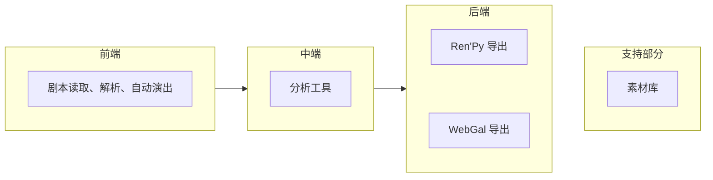

# 功能与模块概述

## 启动入口

语涵编译器项目目前有以下三个可执行文件(EXE)。

### 命令行核心

图标和文件名： preppipe_cli.exe

语涵编译器的核心部分，用 Python 编写。由于语涵编译器在设计之初就想支持第三方集成、允许其他人的程序使用语涵编译器的功能，所以所有的功能、内嵌资源都在命令行核心中，用户或第三方的脚本可以使用这个程序使用所有功能。调用这个命令行模式的文件可以避免在特定环境下由于使用窗口导致出错。除非您知道自己在做什么，否则都推荐用以下的图形界面来使用本程序。

### UI

图标和文件名： preppipe.exe

该 UI 是套在命令行核心外的壳，大部分功能通过调用命令行核心来完成，也由 Python 编写。

## 核心模块

语涵编译器的核心部分目前有以下模块：



??? note "稍微详细一点的版本在这里"

    ``` mermaid
    graph TB
      subgraph frontend["前端"]
        direction LR
        input["剧本读取"]
        lang["语法解析"]
        perform["自动演出"]
        input --> lang;
        lang --> perform;
      end
      subgraph middleend["中端"]
        direction LR
        normalization["规范化、优化"]
        analysis["分析工具"]
        normalization ~~~ analysis;
      end
      subgraph backend["后端"]
        direction LR
        renpy["Ren'Py 导出"]
        webgal["WebGal 导出"]
        renpy ~~~ webgal;
      end
      frontend --> middleend;
      middleend --> backend;
      subgraph support["支持部分"]
        direction LR
        assetlib["素材库"]
        debug["调试工具"]
        assetlib ~~~ debug;
      end
      backend ~~~ support;
    ```

让我们对每个模块逐一进行介绍：

  * 素材库：为了支持在只有剧本、没有素材的情况下生成实机演示，语涵编译器项目内嵌了一些素材。所有素材均可从语涵编译器的代码仓库直接下载，您即使不使用语涵编译器也可以使用我们准备的素材。
  * 前端剧本读取、解析、自动演出：语涵编译器可以读取符合[剧本格式要求](../script/overview.md)的剧本，以此生成游戏工程文件。剧本内可以引用素材库中的内容。
  * 中端分析优化工具：语涵编译器可以分析剧本并生成报告，用以引导制作者进行迭代。详情请见[中端工具总览](../middleend/overview.md)。（注：目前尚不可用）
  * 后端工程导出：语涵编译器目前可以生成 [Ren'Py](../engine/renpy.md) 或 [WebGal](../engine/webgal.md) 的游戏工程。目前 WebGal 的支持仍是试验性质，部分功能用不了，之后会慢慢完善。

前、中、后端在本文档里都有各自的部分进行介绍，详情请阅读对应章节。关于素材的使用方法将在前端部分介绍。
