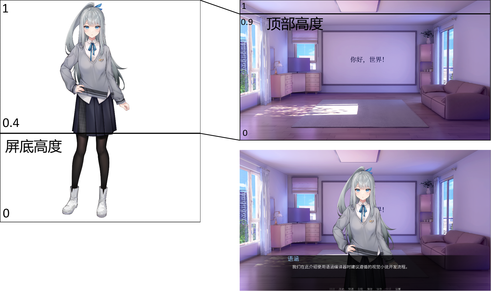
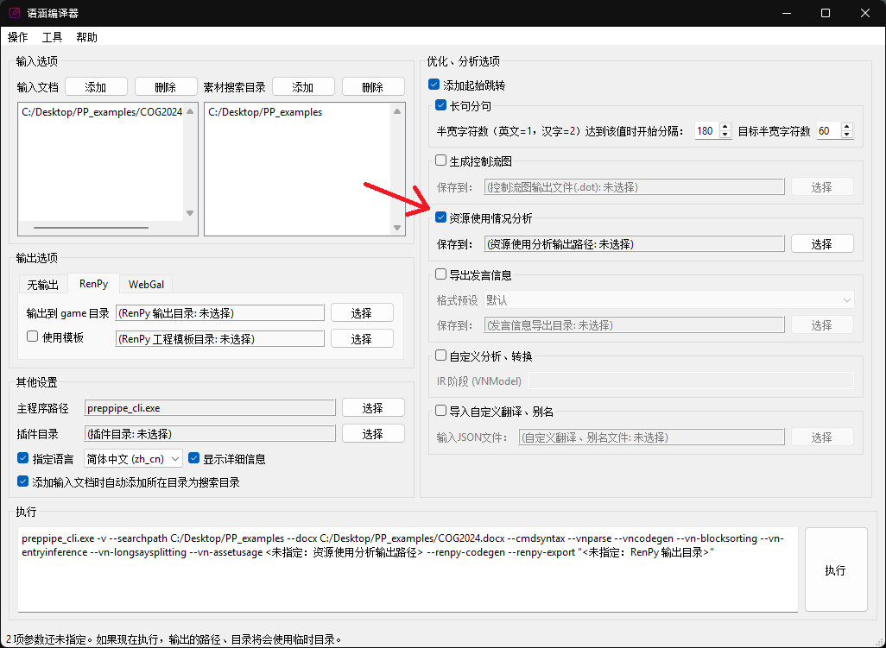

# 用法简介

此页简述了语涵编译器各主要功能的使用方法。

## 剧本和输入

### 文件组织管理

语涵编译器支持读取多个剧本文件。导出游戏工程时，您需要将所有的剧本文件（不包含素材）添加到“输入文档”一栏。各个剧本文件中的内容会保存到各自的引擎脚本中。比如导出为 RenPy 时，每个 .docx 剧本会对应一个 .rpy 输出文件。一般来说，“输入文档”列表里文件的排列顺序不影响输出结果。

剧本文件中可以按路径引用素材。比如在以下情景：

  * 剧本文件在“<我的路径>/第一章.docx”
  * 剧本中提到有个立绘文件在“立绘/女主角”（这里不指定文件后缀名）
  * 那么程序会优先尝试读取“<我的路径>/立绘/女主角\[.png|.jpg|...\]”作为该立绘。

用正式一点的话来说，当在剧本中使用相对路径引用素材时，程序优先使用剧本所在目录作为相对路径的起始位置。我们一般推荐将所有剧本文件放在同一目录下，避免路径引用混乱。

如果您的项目有多个文件（包括剧本和素材等），推荐将他们放在同一目录下。

### 使用“章节”来管理剧本内容

语涵编译器使用“章节”这一概念作为剧情内容的单元。打个比方，中学里同一年级的所有学生都在一个个“班级”之中，“章节”与剧情内容的关系就像是这里“班级”与“学生”的关系，剧情内容一定在某个章节中。“章节”之间没有隶属，每个章节都是独立的，像是不会有一个班包含了另一个班。如果用户没有使用命令指明章节的边界，那么程序默认每个文件中的所有内容都在一个章节下。详情请见下面基础语法的章节部分。

### 错误处理

除非是遇到 Bug 或是其他非常特殊的情况，否则语涵编译器会尽力用当前已知内容生成游戏工程。所有的错误会记录下来并保存在引擎脚本中。目前我们会创建一个额外的角色并将错误信息以“该角色的发言”的形式保存。

## 基础语法

所有命令以方括号包裹，比如：

!!! example "【导出到文件】命令样例"

    【导出到文件: chapter1】

如果此命令在“<我的路径>/第一章.docx”中，导出到 RenPy 时该文件内所有的内容会保存到 `chapter1.rpy` 中。多个命令可以写在同一行（同一段落），但是命令不能与其余内容混合，比如角色对话的段落中不能有命令，如需添加命令请新开一个段落。

备注、注释也是一种命令，您可以用以下方式写注释：

!!! example "注释"

    【注释：这是一句注释】 
    【注：这也是一句注释。这些注释内容都会以相应的注释语法保存在导出的引擎脚本中。】 

### 对话、发言

我们努力使各种各样的常见对话、发言书写形式都能得到直接的支持。以下是我们主要支持的一些形式：

!!! example "发言形式1"

    语涵（微笑）：这是发言1 
    语涵：“这是发言2” 
    语涵：“这是发言3，”这段文本会被忽略，“这是发言3的后半部分” 
    语涵【这是发言4】 
    “语涵”这是发言5 
    【语涵】这是发言6 
    【语涵】（微笑）这是发言7 
    【语涵】“这是发言8，”这段文本会被忽略，“这是发言8的后半部分” 
    【语涵】（微笑）：这是发言9 
    【语涵】：（微笑）这是发言10 

如果您使用其他形式的发言格式，欢迎来联系我们。除上述形式外，发言者的推导采用以下逻辑：

!!! example "发言形式2"

    我：我们抛硬币决定午饭吃什么吧。 
    一枚硬币随即起飞、不停翻转，在空中划出一个完美的抛物线后落在我的手心。 
    “就这么愉快地决定了，我们去吃左边这家店吧。” 

第一句指定了发言者“我”，第二句是旁白发言，第三句是上一位指定的发言者（“我”）说的。

如果某角色的发言非常长，可以采用【长发言】命令：

!!! example "长发言模式"

    【长发言：语涵（微笑）】 
    我们在此宣布：语涵编译器项目准备好进行公开测试了。 
    【切换角色状态：语涵（正常）】 
    虽然还有很多功能没有完成或打磨不够，但我们相信目前完成的功能已经能够帮助部分开发者进行视觉小说开发工作了。 
    【默认发言模式】【注：这里切换回正常状态】 

长发言模式下，除了命令外，所有内容视为指定角色的发言。比如上面例子中第二行本应被解析为一个名叫“我们在此宣布”的角色说了句话，在长发言模式下，这行的所有内容均视为角色“语涵”的发言。

### 角色

如果我们想使用角色立绘、使用表情差分，就需要使用与角色有关的命令。首先，最简单的形式：

!!! example "【声明角色】基础版"

    【声明角色：语涵】

      * 立绘：立绘目录/语涵/正常

该命令让程序记住“语涵”代表一个角色，且使用“立绘目录/语涵/正常.png”（或是其他后缀名的图片）作为立绘。包括【声明角色】在内，所有的声明类指令对所有剧本生效。您可以在一个剧本文件内声明所有内容并在其他文件中引用该角色（让该角色发言、上场等）。由于立绘模板功能目前还没有实装，所以现阶段只能由用户提供立绘。

如果像上述那样有两个差分，则可以用如下形式：

!!! example "【声明角色】进阶1"

    【声明角色：语涵】

      * 立绘：
          * 正常：立绘目录/语涵/正常
          * 微笑：立绘目录/语涵/微笑

该命令中角色“语涵”有两个差分，默认情况下是“正常”，当执行诸如“【语涵】（微笑）：这是发言9”时则使用“微笑”差分。之前【长发言】命令样例中的【切换角色状态】命令也起相同的作用。

除了声明角色之外，要实际使用角色立绘，还需要使用入场和退场指令：

!!! example "角色入场、退场指令"

    【角色入场：语涵】【注：此时立绘以正常差分出现】 
    语涵（微笑）：你好。 
    【注：此时立绘是微笑差分】 
    【角色退场：语涵】【注：此时立绘消失】 

未指定入场角色状态时，状态默认是立绘声明列表里的第一项（上面的样例里是“正常”）。如果想让立绘以特定差分入场，可以这样：

!!! example "角色入场与发言"

    【角色入场：语涵（微笑）】【注：此时立绘以微笑差分出现】 
    语涵：下班收工。 
    【注：此时立绘仍然是微笑差分】 
    语涵（正常）：明天继续。 
    【注：此时立绘是正常差分】 

由于目前程序无法判断立绘类型（全身立绘、半身立绘、非人类对象立绘（飘着的法器等）），默认的立绘位置放置策略选择比较保守，只保证立绘整体在屏幕中。需要调整立绘位置的话需要额外加参数，如下所示：

!!! example "【声明角色】进阶2"

    【声明角色：语涵】

      * 立绘：
          * 正常：立绘目录/语涵/正常
          * 微笑：立绘目录/语涵/微笑
      * 立绘位置设置：立绘默认方案（屏底高度=0.4，顶部高度=0.9）

目前除了绝对位置（手打坐标）外只做了“立绘默认方案”一种位置计算公式：

* 屏底高度：指屏幕的最下沿在立绘图片整体（包含透明部分）所在的高度，0 表示屏幕底部与图片底部对齐，0.5 表示屏幕底部与图片中间对齐（即下半部分在屏幕下面、看不见的区域），1.0 则是整个立绘都在屏幕下面看不见的区域。该值应该在 0 到 1 之间。
* 顶部高度：确定屏幕底部位置后，剩余的图片（包含透明部分）顶部在屏幕所在的高度，0 表示整个立绘都被压没了，0.5 表示立绘剩余的部分可以够到屏幕中间的水平线，1 表示立绘顶部可以够到屏幕顶部。该值应该大于零。

两个值都用 0 表示最下面，1 表示最上面。打个比方，如果用两块纸板分别表示屏幕和立绘，那么把立绘这块纸板在屏底高度以下的部分剪掉、把屏幕在顶部高度以上的部分剪掉，两块纸板剩下的部分就是程序试图去缩放、对齐的部分。我们希望这种方式能让用户在不用算坐标的情况下较为方便地选择纵向位置。目前立绘的横向位置仍由程序决定，暂时无法让用户自主指定横向位置。

### 场景

场景的概念包括了背景和 CG ，唯一的区别是背景的话仍有角色上场、退场，CG 则只有背景，没有角色立绘。场景可以用以下命令进行声明：

!!! example "【声明场景】"

    【声明场景：地点1】

      * 背景：背景目录/地点1/正常

该命令让程序记住有个场景叫“地点1”，且使用“背景目录/地点1/正常.png”（或其他后缀名的图片）作为背景。“背景”部分与【声明角色】的“立绘”部分一致，您可以在该列表中用嵌套的列表来表示多种场景差分。

声明完背景之后，您可以使用以下【切换场景】命令来使用背景：

!!! example "【切换场景】"

    【切换场景：地点1】

【切换场景】除了切换背景图片外，同时也会清空所有在场的角色立绘。如果当前在场的角色需要在新场景中也出现，请再接【角色入场】命令。如果场景有多个背景差分，您也可以使用以下命令指定使用哪个差分：

!!! example "【切换场景】指定差分"

    【切换场景：地点1（傍晚）】

### 背景模板

目前语涵编译器内嵌了三组背景模板，用于在背景素材准备完成前占位。可以这样使用：

!!! example "【声明场景】与背景模板"

    【声明场景：地点1】

      * 背景：预设（小型室内）

目前三组背景模板为：

* 小型室内：可用于任何的房间、私有空间
* 大型室内：可用于较大的室内空间、公共区域
* 室外：用于室外场景

每组背景模板都有以下差分：

* 白天
* 傍晚
* 夜晚-开灯
* 夜晚-关灯

如果您想添加新的差分或者给部分差分新的名字（比如用“夜晚”替代“夜晚-开灯”），可以这样：

!!! example "场景模板后接差分声明"

    【声明场景：地点1】

      * 背景：预设（小型室内）
          * 夜晚：夜晚-开灯

这些背景模板接受个性化调整，屏幕和部分对象可以附上文字、改变颜色。您可以使用如下命令：

!!! example "在屏幕上放“你好，世界！”"

    【声明场景：地点1】

      * 背景：预设（小型室内，屏幕=“你好，世界！”）

!!! example "把屏幕涂绿、把另一对象涂蓝（小型室内模板中为地毯颜色）"

    【声明场景：地点1】

      * 背景：预设（小型室内，屏幕=#00ff00，指示色=#0000ff）

上面的 `#00ff00`(绿色), `#0000ff` （蓝色）是 `#RRGGBB` 格式的颜色，除了使用各种网页版“颜色选择”工具之外，您也可以使用 UI 中“图片包工具”->“添加颜色参数”打开颜色选择对话框，挑选您想要的颜色并获取其编码。

如果想在背景模板中的屏幕上放一张图片，可以把“屏幕”参数的内容换成图片的路径（不带后缀）。

### 音乐

想播放背景音乐的话可以使用以下指令：

!!! example "【背景音乐】，任选一种"

    【背景音乐：bgm1】 
    【BGM：bgm1】 

程序会查找叫“bgm1”的音频文件作为背景音乐。

目前暂不支持停止播放背景音乐，我们会在后续改进中提供该功能。

### 章节

章节是管理剧情内容的基本单元。可以用以下命令来标记章节的开始位置：

!!! example "【章节】"

    【章节：第一章第一节】

该命令之后的所有剧情内容（发言、角色入场退场、场景切换）都属于该章节，直到出现下一个【章节】命令。如果整个文件都没有【章节】命令，程序会创建一个章节并把所有内容置于其中。如果文件有【章节】命令，那么在【章节】命令出现前，文件内不能含发言、角色入场退场等剧情内容，只能有声明、注释等内容。

当章节结束时可使用以下命令：

!!! example "【章节结束】"

    【章节结束】

需要从一个章节跳转至另一个章节时，可使用以下命令：

!!! example "【调用章节】和【转至章节】"

    【调用章节：第一章第二节】【注：第一章第二节的内容结束后，会从这里开始继续执行】 
    【转至章节：第一章第三节】【注：游戏会在执行该命令后“忘掉”在当前章节的进度并跳转至目标章节的开头】 

【转至章节】等效于【调用章节】后立即接【章节结束】。

目前用户暂时无法指定哪个章节作为游戏起始点，程序会自动选择第一个没有被其他章节引用（跳转、调用）的章节作为起始点。我们推荐用户创建一个“主线”章节，里面只包含对其他章节的调用，这样程序一定能选择该章节作为起始点。

!!! example "推荐的章节组织形式"

    【章节：主线】 
    【调用章节：第一章第一节】 
    【调用章节：第一章第二节】 
    …… 
    【调用章节：结尾】 
    【章节结束】 

    【章节：第一章第一节】 
    …… 
    【章节结束】 

    【章节：第一章第二节】 
    …… 
    【章节结束】 
    …… 

### 分支

目前程序只支持【选项】命令作为分支：

!!! example "【选项】基础版样例"

    【选项：第一章选择1】

      * 走左边的路
          * 我慌忙冲进了左边的路，希望能找到一个安全的地方。
          * 不好，这竟然是条死路！
          * 【转至章节：BE1】
      * 走右边的路
          * 右边不远处的路已经断了，过不去。只能只能沿着中间走了。
      * 走中间的路

    沿着中间的路走了十几分钟，我看见了……

选项后列表的第一层级内容视为选项，第二层级视为选项选择后所对应的内容。选项分支的内容执行完毕后，会在选项命令之后的内容中继续。选项的名称（“第一章选择1”）目前用于标注该选项、决定在导出的引擎脚本中如何命名，后续可能会拓展用法。

【选项】命令还有个变体，用于实现循环：

!!! example "循环【选项】"

    【选项：艰难的决定，结束动作=循环】

      * 起床！
          * 今天也要继续加油！
          * 【跳出循环】
      * 继续睡！
          * 充足的睡眠是拥有充沛精力的必要条件。
          * 旁白：“……但是时不时会有这样的担忧浮上心头：现在几点了？”
          * 【注：这里指定旁白是避免冒号前的内容被认作未声明的新角色。游戏到这里后会回到选项开头。】

### 标签

如果想在一个章节内复用部分内容，或是【选项】分支中内容较长但不想专开新的章节，可以使用【标签】命令：

!!! example "【标签】及其用法示例"

    【标签：刚睡醒】 
    这一觉睡得不错。 

    【选项：艰难的决定】

      * 起床！
          * 今天也要继续加油！
      * 继续睡！
          * ……
          * 【转至标签：刚睡醒】

标签只在一个章节内部生效，只能从相同的章节内跳转。

### 未完成的功能

变量、特效、指定转场等功能都还没做，敬请期待。

## 资源使用情况分析

程序可以统计各项资源的使用情况（如每个立绘、背景一共在多少句发言里被用到），辅助用户决定素材制作计划，及早发现不合理的素材安排。请勾选下图所示的选框以启用该功能：

（您不一定需要指定导出位置；程序会把所有未指定的输出都放在新建的临时目录里。）
