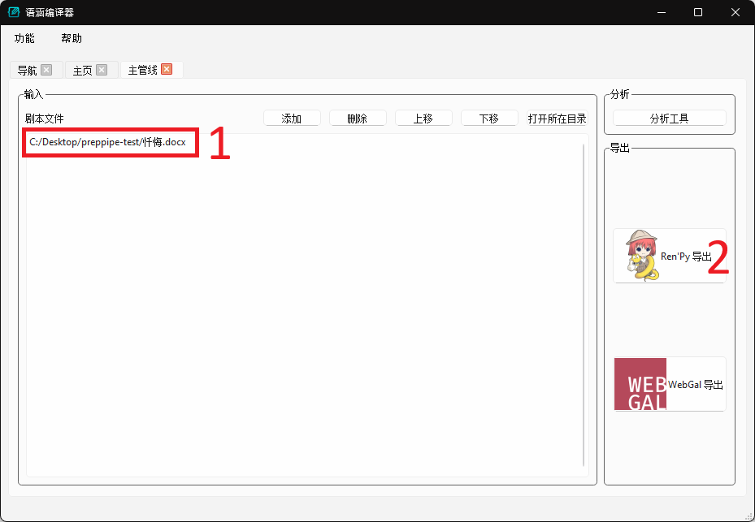
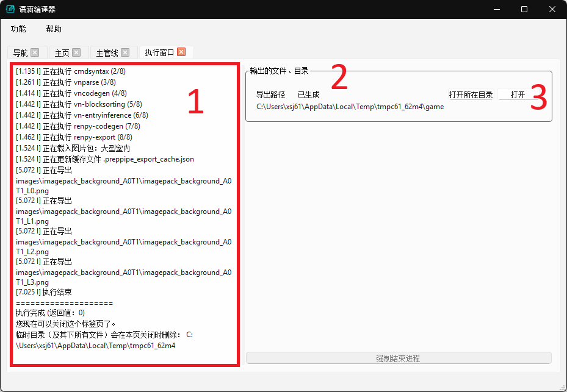

# 主管线快速上手样例

想立即尝试使用语涵编译器的话，可按照本页所述流程进行试用。

!!! note "前置条件"

    由于语涵编译器的导出结果是视觉小说引擎的游戏工程文件，为了使用导出的工程，您仍需掌握任一引擎在不使用本程序时的完整使用方式与流程。

    此样例假设您已经熟悉 [RenPy](https://doc.renpy.cn/zh-CN/quickstart.html) 或 [WebGal](https://docs.openwebgal.com/getting-started.html) 其中一款引擎的使用方法。请选择其中任一引擎完成本页的流程。推荐在尝试以下样例之前，先阅读完所选引擎的操作说明，且确保能够运行引擎附带的初始工程。

!!! note "补足游戏工程"

    由于语涵编译器目前只导出引擎脚本和素材文件，其余内容（如 UI，项目设置等）需要另外准备，所以如果您想尝试运行生成的工程文件，我们还需要用引擎创建一个新的游戏工程来补足剩余的文件。请确保这个新的（没有内容的）工程可以运行。使用语涵编译器时的一般流程为：

      1. 使用所选视觉小说引擎创建一个空的游戏工程
      2. 使用语涵编译器读取剧本并导出工程文件
      3. 将语涵编译器生成的文件移至游戏工程目录。

## 样例文件与准备工作

我们在此提供以下输入样例：

  * [愚公移山.docx](samples/愚公移山.docx){:download}
      * 这是最简单的样例。
  * [忏悔.docx](samples/忏悔.docx){:download}
      * 这是更复杂的样例，展示了常用命令的使用方法。
  * [COG2024.zip](samples/COG2024.zip){:download}
      * 该样例展示内嵌图片、自备立绘的方法。
      * **请在使用前先解压该压缩包**，使用时只需指定其中的 COG2024.docx 文件。

## 主界面

程序启动后，主界面如图所示：

如图中框出的 "2" 所示，程序 UI 的主体由多个标签页组成。标签页可以在此拖拽和关闭。我们以标签页为单位去封装程序的各项功能。

主界面标签页提供了常用的功能入口，点击“主管线”（如图中的 "1" 所示）打开主管线标签页。

## 主管线

主管线对接了语涵编译器中所有需要读取剧本文档的功能。左侧大半的区域是剧本文档列表，您可以通过图中的 "1" 区域的按钮去添加或管理剧本，也可以通过将剧本文件拖拽至列表区域来添加剧本。语涵编译器的分析功能（图中 "2" 区域）暂未完成, 未来我们会更新该区域。目前您可以点击图中 "3" 区域的按钮来将剧本导出为您选择的引擎的游戏工程。

为演示 UI 使用流程，这里我们将一个剧本文档添加进列表（如图中 "1" 所示）并点击 "Ren'Py 导出" 按钮（如图中 "2" 所示），这会打开下面的执行页面。

## 执行页面

主管线的每次运行都会开启一个新的执行页面，该页面记录了以下信息：

  1. 日志区，提供程序执行状态与说明（如图中 "1" 所示）。语涵编译器本体的命令行和输出日志会在这里显示。当看到“执行完成”字样时表示语涵编译器已经完成所有操作。如果碰到严重错误（一般都是出 Bug）、程序崩溃，在这里也能显示报错信息。如碰到此类情况，请在联系开发者时将该区域的内容一并分享。
  2. 输出区，列举了该次执行的所有输出文件（图中 "2" 所示）。语涵编译器会创建一个临时目录来存放所有输出文件，该临时目录将在执行页面标签关闭时或程序关闭时清空。您可以点击“打开”按钮（如图中 "3" 所示）使用系统默认的程序打开所指定的输出项（如果是目录的话也是用文件浏览器打开），或是点击“打开所在目录”来在文件浏览器中找到该输出项。

当执行至如图所示的状态时，游戏工程文件已经生成完毕。您可以将导出的目录里的所有文件移至游戏工程目录并启动游戏。
关于如何使用引擎创建和运行游戏工程，具体操作请参考相应引擎的文档（即未使用本程序时如何运行游戏工程）。

## 接下来做什么

推荐接下来阅读“简介”中的有关页面。

  * 为什么需要语涵编译器：该页详细介绍了语涵编译器项目的主要目标。如果您在思考是否使用本程序，推荐阅读此页。
  * 用法简介：该页大致介绍了语涵编译器的推荐使用方法。如果您决定使用本程序，推荐在阅读更详细的文档前浏览该页。
  * 功能与模块概述：该页大致介绍了现有的所有功能和整体设计。如果您想要查阅更详细的文档，该页中的内容能帮助您定位所需的内容。
