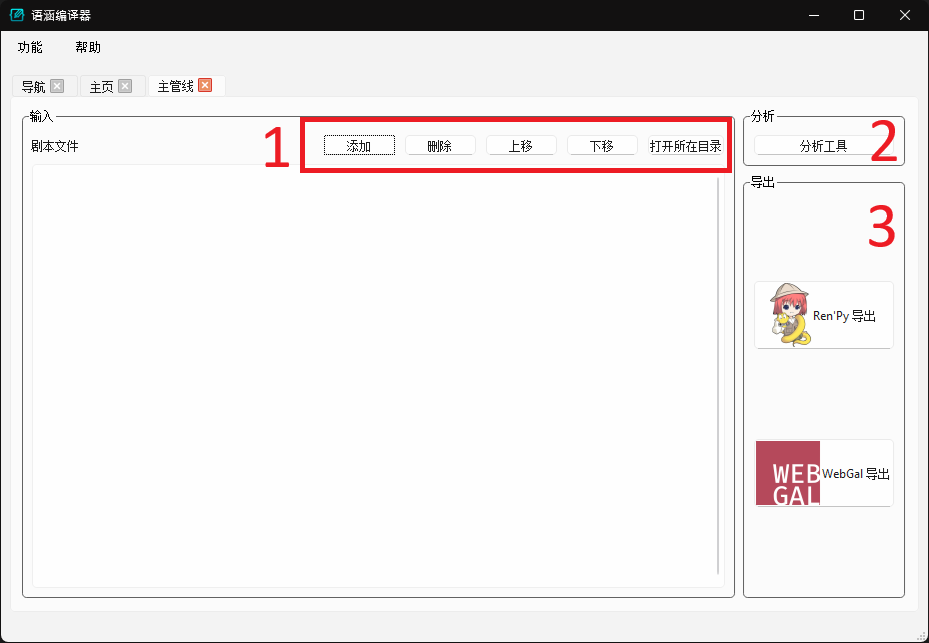

# 主管线快速上手样例

想立即尝试使用语涵编译器的话，可按照本页所述流程进行试用。

此样例假设您已经熟悉 [RenPy](https://doc.renpy.cn/zh-CN/quickstart.html) 或 [WebGal](https://docs.openwebgal.com/getting-started.html) 其中一款引擎的使用方法。请选择其中任一引擎完成本页的流程。推荐在尝试以下样例之前，先阅读完所选引擎的操作说明，且确保能够运行引擎附带的初始工程。

## 样例文件与准备工作

我们在此提供以下输入样例：

  * [愚公移山.docx](samples/愚公移山.docx){:download}
      * 这是最简单的样例。
  * [忏悔.docx](samples/忏悔.docx){:download}
      * 这是更复杂的样例，展示了常用命令的使用方法。
  * [COG2024.zip](samples/COG2024.zip){:download}
      * 该样例展示内嵌图片、自备立绘的方法。
      * **请在使用前先解压该压缩包**，使用时只需指定其中的 COG2024.docx 文件。

## （初版 UI）主界面与操作流程

编写该页时，我们使用的应该是以下初版 UI 的界面：

我们目前只需要了解标记的三处 UI 组件：

  1. 输入文档：剧本、下载后的样例等（以上样例使用 .docx 文档）需要添加到该列表中。您可以点击“添加”按钮或者将相应文件拖拽至其中。
  2. 输出选项：这里有两个输入：
      1. 请通过切换 "RenPy" 或 "WebGal" 标签页来选择输出的游戏工程所适配的引擎。
      2. 输出到 game 目录：可以在这里指定语涵编译器应该将生成的文件存到哪里。
  3. 执行按钮：所有设置准备完成后，点击执行按钮开始生成。

操作流程即为按照上述三项指定输入、输出，并点击执行按钮。注意事项：

  * 对于所有的输出项（比如“输出到 game 目录”），如果在主界面里没有指定，程序会自动创建一个临时目录来存放输出。
  * 由于语涵编译器目前只导出引擎脚本和素材文件，其余内容（如 UI，项目设置等）需要另外准备，所以如果您想尝试运行生成的工程文件，我们还需要用引擎创建一个新的游戏工程来补足剩余的文件。请确保这个新的（没有内容的）工程可以运行。
      * 如果您只想看一下生成的文件、不想运行的话，可以将 game 目录设置留空。

## 执行界面

点击执行按钮后，您会看到以上执行界面。该界面有两个主要部分：

  1. 日志区：语涵编译器本体的命令行和输出日志会在这里显示。当看到“执行完成”字样时表示语涵编译器已经完成所有操作。如果碰到严重错误（一般都是出 Bug）、程序崩溃，在这里也能显示报错信息。如碰到此类情况，请在联系开发者时将该区域的内容一并分享。
  2. 输出区：每一项输出都在这里列出了输出的路径。您可以通过点击“打开”或“打开所在目录”来检查内容。

如果您没有指定所有输出项，语涵编译器会创建临时目录来存放输出。临时目录将在执行窗口关闭后清空。弹出执行窗口后，您仍然可以回到主界面窗口继续设置、执行新的操作，可以有多个执行界面并存。

当游戏工程导出完成后，您就可以运行生成的工程了。具体操作请参考相应引擎的文档（即未使用本程序时如何运行游戏工程）。

## 接下来做什么

推荐接下来阅读“简介”中的有关页面。
  * 为什么需要语涵编译器：该页详细介绍了语涵编译器项目的主要目标。如果您在思考是否使用本程序，推荐阅读此页。
  * 用法简介：该页大致介绍了语涵编译器的推荐使用方法。如果您决定使用本程序，推荐在阅读更详细的文档前浏览该页。
  * 功能与模块概述：该页大致介绍了现有的所有功能和整体设计。如果您想要查阅更详细的文档，该页中的内容能帮助您定位所需的内容。
